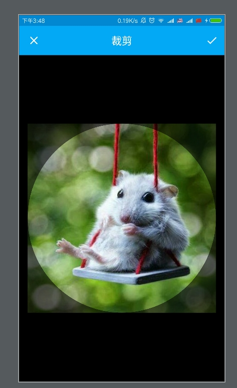
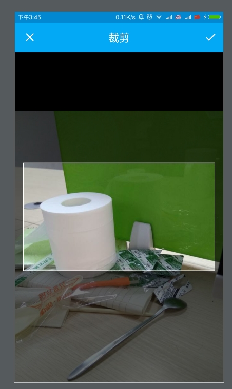
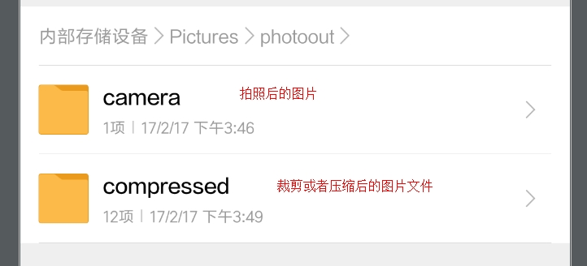
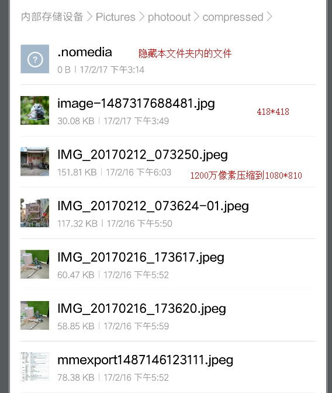

# PhotoOut
[](https://jitpack.io/#hss01248/PhotoOut)

拍照/图片选择--裁剪--压缩 一条龙,兼容7.0,支持fresco和glide,Picasso.多种自定义配置.


> 一条龙地支持fresco和glide,Picasso

图片加载:[ImageLoader](https://github.com/hss01248/ImageLoader)  -->> 图片选择: [PhotoPicker](https://github.com/hss01248/PhotoPicker)  -->>拍照/选图/裁剪/压缩: [PhotoOut](https://github.com/hss01248/PhotoOut)


# 示例图


 


 

 


 

 


# usage

## gradle

**Step 1.** Add the JitPack repository to your build file

Add it in your root build.gradle at the end of repositories:

```
    allprojects {
        repositories {
            ...
            maven { url "https://jitpack.io" }
        }
    }
```

**Step 2.** Add the dependency

```
    dependencies {
    		compile'com.github.hss01248:PhotoOut:1.0.3'
   		//以下的三选一即可:
            	compile'com.github.hss01248.PhotoPicker:glide:1.0.8'
    		compile'com.github.hss01248.PhotoPicker:fresco:1.0.8'
    		compile'com.github.hss01248.PhotoPicker:picasso:1.0.8'
    }
```


## 初始化

传入context

```
PhotoUtil.init(getApplicationContext(),new GlideIniter());//第二个参数根据具体依赖库而定
```

## 裁剪头像

```
PhotoUtil.cropAvatar(true)
        .start(this, new PhotoCallback() {
            @Override
            public void onCancel() {
                super.onCancel();
            }

            @Override
            public void onFail(String msg, Throwable r) {
                super.onFail(msg, r);
            }

            @Override
            public void onSuccessSingle(String originalPath, String compressedPath) {
                super.onSuccessSingle(originalPath, compressedPath);

            }
});
```

## 多图选择

```
PhotoUtil.multiSelect(9)
        .start(this, new PhotoCallback() {
            @Override
            public void onFail(String msg, Throwable r) {
                super.onFail(msg, r);
            }

            @Override
            public void onCancel() {
                super.onCancel();
            }

            @Override
            public void onSuccessMulti(List<String> originalPaths, List<String> compressedPaths) {
                super.onSuccessMulti(originalPaths, compressedPaths);
            }
        });
```

## 自定义

```
PhotoUtil.begin()
		....
		.start(this,photoCallback);
```

## 提供的自定义方法有

```
setFromCamera(boolean fromCamera)
//图片选择相关设置
setSelectGif()
setMaxSelectCount(int maxSelectCount)//默认为9

//裁剪相关设置
setNeedCropWhenOne(boolean needCropWhenOne)//当选择了一张图时,是否需要裁剪.默认false
setCropRatio(int cropRatioX,int cropRatioY)//裁剪框比例,默认1;1
setCropMuskOval()//设置裁剪蒙版为椭圆/圆

//压缩相关设置
setNeedCompress(boolean needCompress)//是否需要压缩,默认为true
setCompressMax(int maxWidth,int maxHeight)//默认都为0--这种情况下采用微信的压缩策略.如果设置了两个不为0的值,则按照要求来压缩
setCompressDir(String compressedDirPath)//压缩后的图片文件保存到哪个文件夹.默认是picture/photoout/compressed
setCompressRename(Renameable renameable)//压缩后的图片文件如何重命名.默认使用原文件名

```

注: exif经过剪切/压缩已经清除.如果是选择原图,则exif依然存在.后续上传请自行清除.

## 回调

```
public abstract class PhotoCallback {
    public  void onFail(String msg,Throwable r){
        Log.e("onFail",msg);
        r.printStackTrace();

    }
    public  void onSuccessSingle(String originalPath,String compressedPath){
        Log.e("onSuccessSingle",originalPath+"\n----compressedPath----\n"+compressedPath);

    }
    public  void onSuccessMulti(List<String> originalPaths,List<String> compressedPaths){
        Log.e("onSuccessMulti",MyTool.getListStr(originalPaths)+"\n----compressedPaths----\n"+MyTool.getListStr(compressedPaths));

    }
    public  void onCancel(){
        Log.e("onCancel","onCancel");
    }
}
```

## manifest中:

## 添加权限

```
<uses-permission android:name="android.permission.WRITE_EXTERNAL_STORAGE"/>
<uses-permission android:name="android.permission.CAMERA"/>
<uses-permission android:name="android.permission.READ_EXTERNAL_STORAGE"/>
```

## 添加3个activity

```
<activity android:name="me.iwf.photopicker.PhotoPickerActivity"
    android:theme="@style/customTheme"
    />

<activity android:name="me.iwf.photopicker.PhotoPagerActivity"   
    android:theme="@style/customTheme"/>

<activity
    android:name="com.yalantis.ucrop.UCropActivity"
    android:screenOrientation="portrait"
    android:theme="@style/customTheme"/>
```

## 定义上面三个activity样式:状态栏和 标题栏颜色

### values\styles文件中添加下面的一个style(不要更改,直接copy):

```
<style name="customTheme" parent="Theme.AppCompat.Light.NoActionBar">
    <item name="colorPrimary">@color/colorPrimary</item>//标题栏背景色
    <item name="colorPrimaryDark">@color/colorPrimaryDark</item>//状态栏背景色
</style>
```

### values\colors文件中

指定colorPrimary,colorPrimaryDark的颜色.


# 混淆

```
-dontwarn com.yalantis.ucrop**

-keep class com.yalantis.ucrop** { *; }

-keep interface com.yalantis.ucrop** { *; }
# Glide
-keep public class * implements com.bumptech.glide.module.GlideModule
-keep public enum com.bumptech.glide.load.resource.bitmap.ImageHeaderParser$** {
    **[] $VALUES;
    public *;
}
# nineoldandroids
-keep interface com.nineoldandroids.view.** { *; }
-dontwarn com.nineoldandroids.**
-keep class com.nineoldandroids.** { *; }
# support-v7-appcompat
-keep public class android.support.v7.widget.** { *; }
-keep public class android.support.v7.internal.widget.** { *; }
-keep public class android.support.v7.internal.view.menu.** { *; }
-keep public class * extends android.support.v4.view.ActionProvider {
    public <init>(android.content.Context);
}
# support-design
-dontwarn android.support.design.**
-keep class android.support.design.** { *; }
-keep interface android.support.design.** { *; }
-keep public class android.support.design.R$* { *; }
```

# 引用

https://github.com/hss01248/ImageLoader

https://github.com/hss01248/PhotoPicker

https://github.com/hss01248/PicCrop

https://github.com/hss01248/AdvancedLuban


# 感谢

https://github.com/donglua/PhotoPicker

https://github.com/Yalantis/uCrop

https://github.com/shaohui10086/AdvancedLuban
